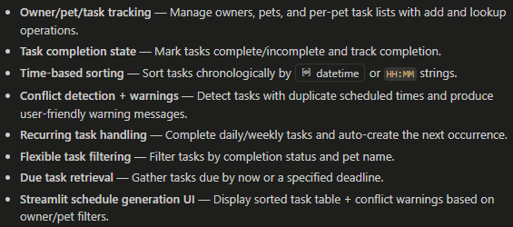

# PawPal+ (Module 2 Project)

You are building **PawPal+**, a Streamlit app that helps a pet owner plan care tasks for their pet.

## Scenario

A busy pet owner needs help staying consistent with pet care. They want an assistant that can:

- Track pet care tasks (walks, feeding, meds, enrichment, grooming, etc.)
- Consider constraints (time available, priority, owner preferences)
- Produce a daily plan and explain why it chose that plan

Your job is to design the system first (UML), then implement the logic in Python, then connect it to the Streamlit UI.

## What you will build

Your final app should:

- Let a user enter basic owner + pet info
- Let a user add/edit tasks (duration + priority at minimum)
- Generate a daily schedule/plan based on constraints and priorities
- Display the plan clearly (and ideally explain the reasoning)
- Include tests for the most important scheduling behaviors

## Getting started

### Setup

```bash
python -m venv .venv
source .venv/bin/activate  # Windows: .venv\Scripts\activate
pip install -r requirements.txt
```

### Suggested workflow

1. Read the scenario carefully and identify requirements and edge cases.
2. Draft a UML diagram (classes, attributes, methods, relationships).
3. Convert UML into Python class stubs (no logic yet).
4. Implement scheduling logic in small increments.
5. Add tests to verify key behaviors.
6. Connect your logic to the Streamlit UI in `app.py`.
7. Refine UML so it matches what you actually built.

# Testing PawPal+

To run tests: python -m pytest

1. test_mark_completed_updates_completion_status verifies that Task.mark_completed() marks tasks to b complete
2. test_add_task_increases_pet_task_count verifies that tasks are added corectly
3. test_scheduler_sort_and_conflict_detection verifis that sort and conflicts are found correctly incase of duplicate scheduled tasks.
4. test_scheduler_recurring_reschedule validates that completeing a daily task will create a new next-day task to mimic recurring tasks
5. test_scheduler_complete_task_creates_next_recurring_instance checks for daily tasks and preservse the recurring quality of daily tasks
6. test_scheduler_complete_task_nonrecurring_returns_same_task confirms that one-time tasks are marked as completed and does not add a new task
7. test_scheduler_filter_tasks_by_completed_and_pet_name validates that filter works by filtering by completion status and by pet name
8. test_sort_tasks_by_time_hhmm_string checks that time strings are sorted correctly in chronological order

# Features

<a href="image.png" target="_blank"></a>.